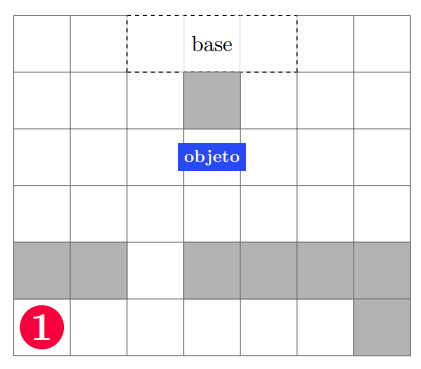
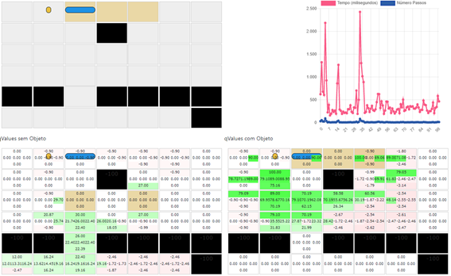

# JS-Q-Learning
Implementação do algoritmo QLearning em Javascript

### O problema

Considere o problema de mundo em grade ilustrado a seguir:



Neste cenário, um agente (em vermelho) deve percorrer a grade 7x6, encontrar o objeto e transporta-lo até na base. Essa tarefa deve ser executada na menor quantidade de passos de tempo possível. O agente não possui nenhum conhecimento préviio sobre o ambiente, o qual possui paredes, representadas pelas c´elulas pintadas de cinza, as quais ele não transpor. O agente também não possui conhecimento prévio sobre a localização do objeto. A localizaçãoo inicial do agente, disposição das paredes e objeto são sempre fixas, conforme indicado na ilustração. A cada passo de tempo, o agente pode executar os seguintes movimentos na grade:

* mover para cima;
* mover para baixo;
* mover para esquerda;
* mover para a direita;
* permanecer na mesma célula.

Este cenário apresenta algumas restrições de movimentação:

* O agente pode realizar apenas uma movimentalção por passo de tempo.
* Se o agente escolher se mover para uma célula que não está vazia, seja por conta de uma parede ou objeto, ele n˜ao se move, i.e., permanece na mesma c´elula.
* Qualquer tentativa de locomoção para além da grade, resultará na não movimentação do agente.
* O objeto só pode ser agarrado pela sua esquerda ou direita.
* Quando o agente é posicionado a direita ou esquerda do objeto, o objeto é agarrado automaticamente.
* Uma vez agarrado o objeto, o agente não pode solta-lo;
* O agente, quando agarrado ao objeto, s´o consegue se mover para uma nova célula desde que
não haja nenhuma restrição de movimentação para o agente e objeto. O episódio é concluído automaticamente quando o objeto entra na base ou se atingir um número
máximo de passos de tempo sem resolver a tarefa. Em ambos os casos, um novo episódio é reiniciado, com o agente e objeto situados conforme

### A resolução

Para resolver o problema, foi utilizada uma implementação em javascript. Para mostrar visualmente os resultados, foi utilizada a biblioteca jQuery, chart.js e Bootstrap.

Os elementos principais da solução são:

```javascript

let parar = false;
let velocidade = 500;
let epsilon = 0.9;
let discountFactor = 0.9;
let learningRate = 0.9;
let numeroEpocas = 100;
let objeto=[2,3];

//inicia o mundo
function initGridWorld(environment_rows = 6, environment_columns = 7){

    const q_values = [];

    for(let i = 0; i< environment_rows; i++){
        q_values[i]=[];
        for(let j=0; j<environment_columns;j++ ){
            q_values[i][j]=[];
            for(let k=0; k<2;k++ ){
                q_values[i][j][k]=[0,0,0,0,0];
            }
        }
    }
    return q_values;
}

//inicia recompensas
function initRecompensas(environment_rows = 6, environment_columns = 7){

    const rewards = [];

    for(let i = 0; i< environment_rows; i++){
        rewards[i]=[]
        for(let j=0; j<environment_columns;j++ ){
            rewards[i][j]=[];
            for(let k=0; k<2;k++ ){
                rewards[i][j][k]=-1;
            }
        }
    }

    rewards[0][2][1]=100;
    rewards[0][3][1]=100;
    rewards[0][4][1]=100;

    rewards[1][3][0]=-100;
    rewards[1][3][1]=-100;

    rewards[2][2][0]=30;
    rewards[2][4][0]=30;

    //primeira linha
    for(let j=0; j<environment_columns;j++ ){
        rewards[4][j]=[];
        for(let k=0; k<2;k++ ){
            rewards[4][j][k]=-100;
        }
    }

    rewards[4][2][0]=-1;
    rewards[4][2][1]=-1;

    rewards[5][6][0]=-100;
    rewards[5][6][1]=-100;

    return rewards;
}

// calcular recompensar
function getReward(rewards,currentRowIndex, currentColumnIndex,k){
    return rewards[currentRowIndex][currentColumnIndex][k];
}

//verifica se é estado terminal
function isTerminalState(rewards, currentRowIndex, currentColumnIndex,k){
    return rewards[objeto[0]][objeto[1]][k] === 100 || parar;
}

// posição inicial
function getStarterLocation(){
    return [5,1];
}

// próxima posição
function getNextAction(qValues, currentRowIndex, currentColumnIndex,k, epsilon){
    if (Math.random() < epsilon){
        return indexOfMax(qValues[currentRowIndex][currentColumnIndex][k]);
    } else {
        return getRandomInt(0,5);
    }
}

// próxima posição
function getNextLocation(rewards, actions, currentRowIndex, currentColumnIndex,k, actionIndex, environment_rows = 5, environment_columns = 6){

    if(actions[actionIndex] === 'stop'){
        return [currentRowIndex, currentColumnIndex,k];
    }

    let new_row_index = currentRowIndex;
    let new_column_index = currentColumnIndex;

    let new_object= Object.assign({}, objeto);

    if (actions[actionIndex] === 'up' && currentRowIndex > 0){
        new_row_index -= 1;
        new_object[0] -=1;
    } else if(actions[actionIndex] === 'right' && currentColumnIndex < environment_columns - 1){
        new_column_index += 1;
        new_object[1] +=1;
    } else if(actions[actionIndex] === 'down' && currentRowIndex < environment_rows - 1){
        new_row_index += 1;
        new_object[0] +=1;
    } else if(actions[actionIndex] === 'left' && currentColumnIndex > 0){
        new_column_index -= 1
        new_object[1] -=1;
    }

    //checka se chegou ate o objeto
    if(rewards[new_row_index][new_column_index][k] === 30){
        return [new_row_index, new_column_index,1];

    //checka se vai esbarrar no objeto
    } else if (new_row_index === new_object[0] && new_column_index === new_object[1]) {
        return [currentRowIndex, currentColumnIndex,k];

    //checka se nao vai esbarrar na parede
    } else if (rewards[new_row_index][new_column_index][k] === -100 || (k===1 && rewards[new_object[0]][new_object[1]][k] === -100)) {
        return [currentRowIndex, currentColumnIndex,k];

    //senao avanca
    } else {
        if(k===1){
            objeto = new_object;
        }
        return [new_row_index, new_column_index,k];

    }

}

// Inicio treinamenot
async function train(qValues,rewards,actions){

    for(let episode=0; episode < numeroEpocas; episode++) {
    
        const start = getStarterLocation();
        let rowIndex = start[0];
        let columnIndex = start[1];
        let k = 0;
        objeto = [2,3];

        let terminalState = isTerminalState(rewards, start[0], start[1],k);
        if(terminalState){
            return false;
        }
        await runEpisode(qValues,epsilon,actions,rewards,rowIndex,columnIndex,k,terminalState,discountFactor,learningRate,episode);
    }

}

// rodar episódio
function runEpisode(qValues,epsilon,actions,rewards,rowIndex,columnIndex,k,terminalState,discountFactor,learningRate,episode){

    velocidade = $('#velocidade').val();
    let passos = 0;

    return new Promise( resolve => {

        const startTime = new Date();

        // utilizado o função de setInterval para forçar atualização de tela
        const process = setInterval(function () {

            // próxima ação
            const actionIndex = getNextAction(qValues, rowIndex, columnIndex,k, epsilon);

            const oldRowIndex = rowIndex;
            const oldColumnIndex = columnIndex;

            // próxima localização
            const nextIndex = getNextLocation(rewards,actions, rowIndex, columnIndex,k, actionIndex);

            rowIndex = nextIndex[0];
            columnIndex = nextIndex[1];

            let reward =0;
            if(k===1){
                reward =rewards[objeto[0]][objeto[1]][k];
            } else {
                reward =rewards[rowIndex][columnIndex][k];
            }

            const oldQValue = qValues[oldRowIndex][oldColumnIndex][k][actionIndex];

            const maxValue = qValues[rowIndex][columnIndex][k].reduce(function (a, b) {
                return Math.max(a, b);
            });

            // cálculo principal do qValue
            const temporalDifference = parseFloat(reward + (discountFactor * maxValue - oldQValue));
            const newQValue = parseFloat(oldQValue + (learningRate * temporalDifference));

            qValues[oldRowIndex][oldColumnIndex][k][actionIndex] = newQValue;

            k = nextIndex[2];
            
            //verifica se é estado terminal
            terminalState = isTerminalState(rewards, rowIndex, columnIndex,k);

            const endTime = new Date();
            const timeDiff = endTime - startTime;

            if (terminalState) {
                resolve(true);
            }

        }, velocidade);

    });

}

```

Como referência para a solução inicial, pode-se consultar:
https://towardsdatascience.com/implement-grid-world-with-q-learning-51151747b455

### Imagens da solução

Da esquerda para direita, de cima para baixo: Visão geral, gráfico de resultados, quadro de estado sem objeto e com objeto.



### Como executar

Baixar os arquivos e executar o arquivo "index.html".

Para dúvidas: recigio@gmail.com

